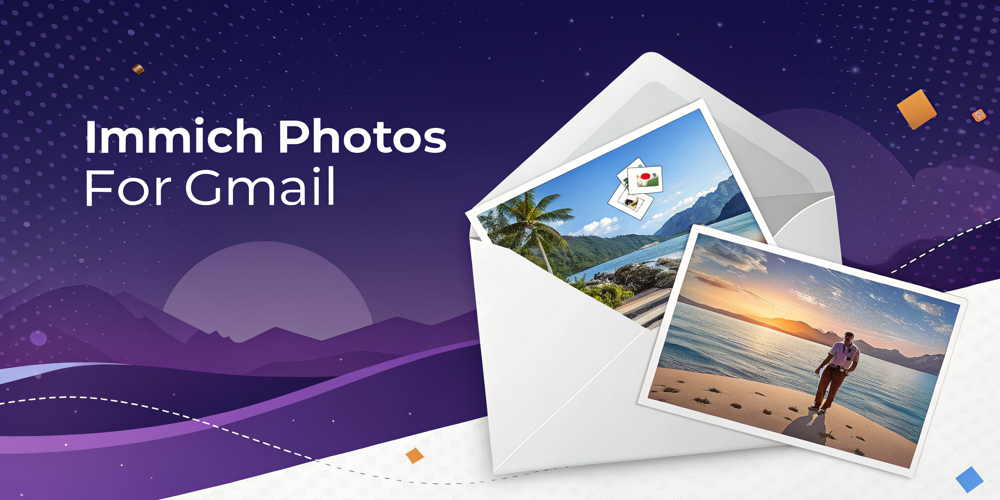
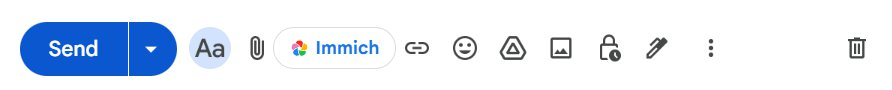
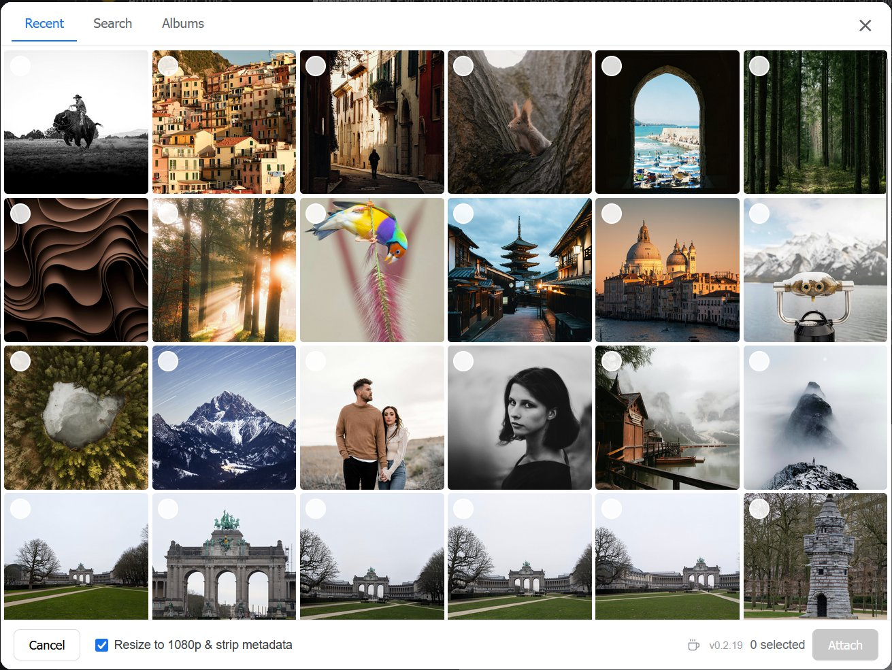
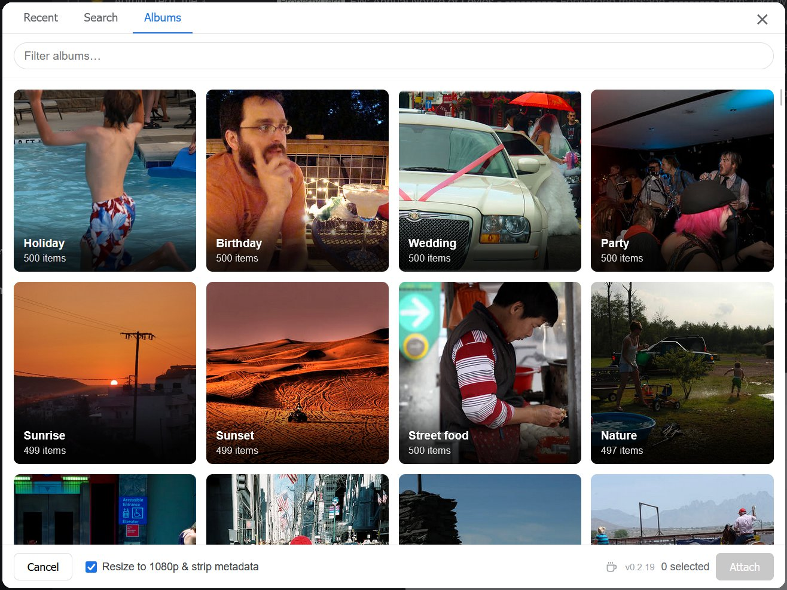

# Immich Photos for Gmail

<p align="center">
  
</p>

[](https://ko-fi.com/richard1912)
[](LICENSE)
[](https://www.mozilla.org/firefox/)
[](https://www.google.com/chrome/)

A browser extension that lets you attach photos from your self-hosted [Immich](https://immich.app) library directly to Gmail emails. No more download, then re-upload round trip. Works in **Firefox** and **Chrome / Edge**.

<p align="center">
  <em>Recent, Search, Albums. Pick photos in two clicks. Attached as native Gmail files.</em>
</p>

## Features

<p align="center">
  
  <br />
  <em>The Immich button sits inline in the Gmail compose action toolbar.</em>
</p>

<p align="center">
  
  <br />
  <em>The picker. Recent, Search, Albums tabs. Multi-select. Optional resize and strip-metadata toggle in the footer.</em>
</p>

<p align="center">
  
  <br />
  <em>Albums tab with a live filter and a square-card grid. Each card shows the album cover, name, and item count.</em>
</p>

- **Adds an "Immich" button** to the Gmail compose toolbar.
- **Picker overlay** with three tabs:
  - **Recent**: your timeline, infinite-scrolled.
  - **Search**: full-text search ("beach 2024", "Alice", "snow").
  - **Albums**: browse your existing albums.
- **Real attachments**: files land in the draft as native Gmail attachment chips, exactly like clicking the paperclip.
- **Optional resize + strip metadata**: single checkbox in the picker footer downscales the longest side to 1920px and re-encodes as JPEG, dropping EXIF / GPS / camera tags.
- **Local-only**: your API key is stored in `browser.storage.local`, never sent anywhere except your own Immich server.

## Install

### Firefox

> Mozilla AMO listing pending. For now, the extension is distributed as a signed `.xpi` via GitHub Releases.

1. Download the latest `immich-photos-for-gmail-X.Y.Z.xpi` from the [Releases page](https://github.com/richard1912/immich-photos-for-gmail/releases).
2. Open Firefox → `about:addons`.
3. Drag the `.xpi` onto the page (or click the gear icon → **Install Add-on From File…**).
4. Approve the permission prompt for `mail.google.com`.

### Chrome / Edge

> Chrome Web Store listing pending. For now, load as an unpacked extension.

1. Download `immich-photos-for-gmail-X.Y.Z-chrome.zip` from the [Releases page](https://github.com/richard1912/immich-photos-for-gmail/releases) and unzip it (or [build from source](#chrome--edge-build)).
2. Open `chrome://extensions` (or `edge://extensions`) and enable **Developer mode**.
3. Click **Load unpacked** and select the unzipped folder.
4. Approve the permission prompt for `mail.google.com`.

The settings page will open automatically on first install.

## Setup

1. In Immich → click your profile → **Account Settings** → **API Keys** → **New API Key**.
2. Copy the generated key.
3. In the extension settings tab:
   - **Immich base URL**: e.g. `https://immich.example.com` (no trailing slash).
   - **API key**: paste the key.
4. Click **Save & Connect**. The browser will request permission to access your Immich origin; accept it. The extension verifies the credentials by hitting `/api/users/me`.
5. Open Gmail → click **Compose** → an **Immich** button appears next to the paperclip.

## Usage

1. In a Gmail compose window, click **Immich**.
2. Browse / search / pick photos. Click thumbnails to multi-select.
3. (Optional) Tick **"Resize to 1080p & strip metadata"** in the footer if you want smaller / private-friendlier attachments.
4. Click **Attach (N)**. Files appear as normal attachment chips in the compose window.

## Privacy

- Your Immich URL and API key are stored locally via `browser.storage.local` and only sent to your Immich server.
- No telemetry, no analytics, no third-party servers.
- The extension only runs on `https://mail.google.com/*` and the Immich origin you configure.

See [PRIVACY.md](PRIVACY.md) for details.

## Building from source

```bash
git clone https://github.com/richard1912/immich-photos-for-gmail.git
cd immich-photos-for-gmail
# Pack a development XPI (just a zip of the directory):
zip -r immich-photos-for-gmail.xpi . -x "*.git*" "icons/source/*" "*.md" "LICENSE"
```

To install the unsigned development build, you need [Firefox Developer Edition](https://www.mozilla.org/firefox/developer/) or [Nightly](https://www.mozilla.org/firefox/channel/desktop/#nightly) and set `xpinstall.signatures.required` to `false` in `about:config`.

For a signed build that installs in stock Firefox, use [`web-ext sign`](https://extensionworkshop.com/documentation/develop/web-ext-command-reference/#sign) with your Mozilla AMO API credentials.

### Chrome / Edge build

```bash
python scripts/build_chrome.py
```

This produces `web-ext-artifacts/immich-photos-for-gmail-X.Y.Z-chrome.zip` and an unpacked staging directory at `web-ext-artifacts/chrome/`. To load it:

1. Open `chrome://extensions` (or `edge://extensions`).
2. Enable **Developer mode**.
3. Click **Load unpacked** and select `web-ext-artifacts/chrome/`.

The Chrome build uses `manifest.chrome.json` as its source-of-truth manifest. The same `.js` / `.css` / `.html` files are reused — a small `globalThis.browser ||= globalThis.chrome` shim at the top of each script makes them work in both browsers.

## Compatibility

- **Firefox 128+** (Manifest V3 with `optional_host_permissions` and `world: "MAIN"` content scripts).
- **Chrome / Edge** via a separate build (see [Building from source](#building-from-source)). The Chrome build uses the same source files with a service-worker manifest and is loaded as an unpacked extension.
- Tested on the modern Gmail UI (`mail.google.com`).

## Limitations

- HEIC / HEIF / RAW originals can't be re-encoded by the browser's `createImageBitmap`. With the resize option on, those files are sent as their original bytes.
- Gmail's 25MB attachment ceiling still applies. Large originals will be rejected by Gmail (the chip will appear, then disappear with an error). Use the resize option for big photos.

## Support development

This extension is free and open source. If it saves you time, you can buy me a coffee:

<p>
  <a href="https://ko-fi.com/richard1912">
    
  </a>
</p>

## License

MIT. See [LICENSE](LICENSE).
